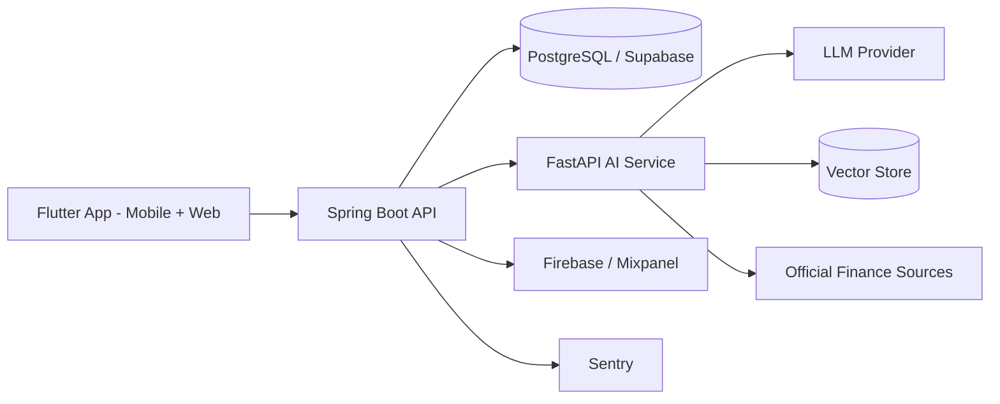

# 04. Architecture

## 초기 시스템 구성



## 저장소 구성

```text
didim/
├── frontend/   # Flutter Mobile App
├── backend/    # Spring Boot API
├── ai/         # FastAPI AI/RAG Service
└── shared/     # API contracts and sample data
```

전체 저장소는 하나의 Git 루트로 관리한다. 실제 구현은 영역별 폴더에 나누고, 공통 계약은 `shared/`에 둔다.

## 앱 (모바일 + 웹)

- Flutter, Dart — 하나의 코드베이스로 android, ios, web 타깃을 빌드한다
- Riverpod 기반 상태 관리
- Go Router 기반 라우팅
- 핵심 화면: 온보딩, 진단 결과, 주간 챌린지, AI 코칭, 회고, 금융 여정 지도
- 서비스 웹은 Flutter 웹 타깃으로 제공한다. SEO가 필요한 마케팅 랜딩페이지는 Flutter Web으로 만들지 않고 필요 시 별도 `web/` 영역에 둔다

## 백엔드

- Spring Boot 3.x, Java 17
- 사용자, 진단 결과, 챌린지, 완료 상태, 회고, 이벤트 로그 관리
- 인증, API 권한, 서비스 로직 담당

## AI 서비스

- FastAPI, Python
- 입력 구조화, RAG 검색, LLM 호출, 프롬프트 관리
- 룰 엔진 또는 백엔드 룰 엔진과의 연동

## 데이터 모델 초안

- user
- financial_profile
- diagnosis
- challenge
- challenge_assignment
- challenge_progress
- reflection
- ai_conversation
- source_document
- analytics_event

## MVP에서 피할 것

- 초기부터 계좌 연동을 전제로 설계하지 않는다.
- 상품 추천과 가입 대행을 핵심 경험으로 두지 않는다.
- 모든 금융 영역을 한 번에 다루지 않는다.
- AI가 단독으로 진단 결론을 내리게 하지 않는다.
